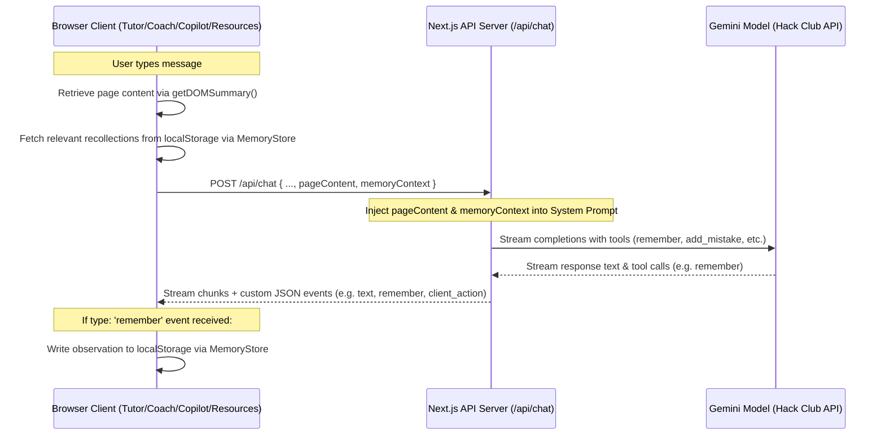

# JEE OS: AI Agent Fixes, Findings & System Handoff

This document details the architectural findings, database sync constraints, client-server memory model, page-awareness design, and code quality fixes implemented in **JEE OS**. It serves as a supplementary handoff reference for engineering teams working on the state synchronization engine and agentic capabilities in **JEE OS**.

---

## 1. System Understanding & Architecture

**JEE OS** is an interactive preparation platform for candidates of the Joint Entrance Examination (JEE) in India. Its frontend React state acts as the single source of truth, synchronizing automatically with a Postgres database on Supabase SSR.

### Key Modules & State Fields
*   **Syllabus Tracker**: Stores a tree representation of all subjects (Physics, Chemistry, Mathematics), chapters, and topics (`state.syllabus`).
*   **Revision Engine & Spaced Repetition**: Implements a spaced repetition schedule. Completing a topic triggers revision tasks due on Day 1, Day 7, and Day 30 (`state.revisions`).
*   **Study Logger**: Records timed study logs linked to specific subjects/chapters/topics (`state.studyLogs`).
*   **Test Engine**: Generates custom or adaptive tests, tracks score performance, and logs incorrect answers (`state.testAttempts`, `state.mistakes`).
*   **AI Copilot & Agents**: Streams guidance and lets users execute destructive/constructive actions via agentic tools (such as `reset_syllabus`, `generate_mock_test`, `add_mistake`).

---

## 2. Shared Memory & Page-Awareness Architecture

Previously, the server-side API `/api/chat/route.ts` was sandboxed from browser-side client storage. The server-side `MemoryStore` could not directly read or write the student's recollections. To resolve this, we implemented a complete client-server memory synchronization model:

### Key Components:
1.  **Page Content (DOM) Awareness:**
    *   On query submit, the client scrapes the active page context using `getDOMSummary(pathname)`.
    *   This DOM context is forwarded as `pageContent` in the request body to `/api/chat` and injected directly into the Gemini system prompt under the `### Current Screen Context (DOM Summary)` header.
2.  **Recollections (Memory) Integration:**
    *   The client instantiates a client-side `MemoryStore` and retrieves relevant recollections using `memory.getContextString(latestQuery, 8)`.
    *   This is passed as `memoryContext` in the POST body to `/api/chat` and appended to the prompt.
3.  **Client-Driven Memory Persistence:**
    *   Native `remember` tool calls executed by the LLM are caught by `route.ts` and streamed back as a custom JSON event (`type: 'remember'`).
    *   The client catches this event in its streaming reader and saves the observation using `memory.add()`.

---

## 3. Hermes Meta-Cognitive Reflections (AI Growth)

To allow the AI to adapt and grow to the user's responses, we built a client-driven reflection cycle:
*   At the end of every conversation stream, if an assistant response was successfully received, the client makes a synchronous POST call to `/api/chat` with `{ action: 'reflect', query, response, context }`.
*   The API delegates this to **Hermes** (a meta-cognitive prompt template) which returns structured JSON detailing:
    *   `userPersonaInsight`: A single insight about this user's learning style.
    *   `adaptationNotes`: An array of strings describing how future responses should adapt to the student.
*   The client writes these insights directly into the client-side `MemoryStore` under the tags `['hermes', 'persona']` and `['hermes', 'adaptation']` respectively.

---

## 4. Advanced Spaced-Repetition Tool Calls

We expanded the available tool schemas to support direct interaction with the spaced-repetition revision database:

*   **`add_mistake`:**
    *   **Parameters:** `topicName`, `questionText`, `options`, `correctAnswer`, `userAnswer`, `explanation`.
    *   **Behavior:** Triggered when the student makes a conceptual error. The handler resolves `topicName` to a valid database ID, chapter, and subject, then dispatches `ADD_MISTAKE` to mutate local state.
*   **`resolve_mistake`:**
    *   **Parameters:** `mistakeId`.
    *   **Behavior:** Triggered when the student demonstrates mastery of a previously failed question, dispatching `RESOLVE_MISTAKE`.

---

## 5. Bugs Discovered & Implemented Fixes

During the audit and enhancement phases, the following issues were discovered and resolved:

### 5.1. Custom vs. Global Store Action Discrepancy
*   **Issue:** The resources page (`src/app/resources/page.tsx`) defined a local copy of `handleStoreAction` which took positional parameters. This caused crashes when the LLM called general navigation or plan tools.
*   **Fix:** Removed the local copy and imported the global `handleStoreAction` from `@/utils/handleStoreAction` using the object configuration parameters `{ dispatch, getTopicById, ... }`.

### 5.2. Missing Dynamic Question Caching in Coach & Copilot
*   **Issue:** The AI Coach and Copilot did not look for `generate_mock_test` actions or cache dynamic RAG questions generated on-the-fly.
*   **Fix:** Updated their event parsing loops to cache dynamic questions under a `dq-` key in `sessionStorage` and inject `dqKey` into the client action arguments prior to navigation.

### 5.3. Hoisting Error in Tutor Page
*   **Issue:** In `src/app/tutor/page.tsx`, `createNewSession` was declared as an arrow function variable `const createNewSession = () => {}` but accessed inside a `useEffect` hook above its declaration, causing an ESLint initialization order crash.
*   **Fix:** Converted `createNewSession` to a standard hoisted function statement `function createNewSession() {}`.

### 5.4. Playwright Overload Mismatch
*   **Issue:** In `e2e/persistence.spec.ts`, Playwright tests were using `test.skip('message')` which is an invalid overload, causing Type-Checking compilation failure.
*   **Fix:** Changed both calls to `test.skip(true, 'message')`.

### 5.5. Trailing Duplicate Syntax in Copilot
*   **Issue:** The Floating AI Copilot code ended up with nested duplicate code blocks during file content replacements.
*   **Fix:** Cleaned up and deleted the trailing duplicate `finally` blocks and syntax artifacts.

---

## 6. Verification & Validation Status

- **Type Safety (`npx tsc --noEmit`):** Compiles successfully with **0 errors**.
- **ESLint (`npm run lint`):** Passes successfully with **0 errors** (excluding standard warnings).
- **Next.js Production Build (`npm run build`):** Compiles and generates static pages successfully in **9.2 seconds** with Turbopack.
